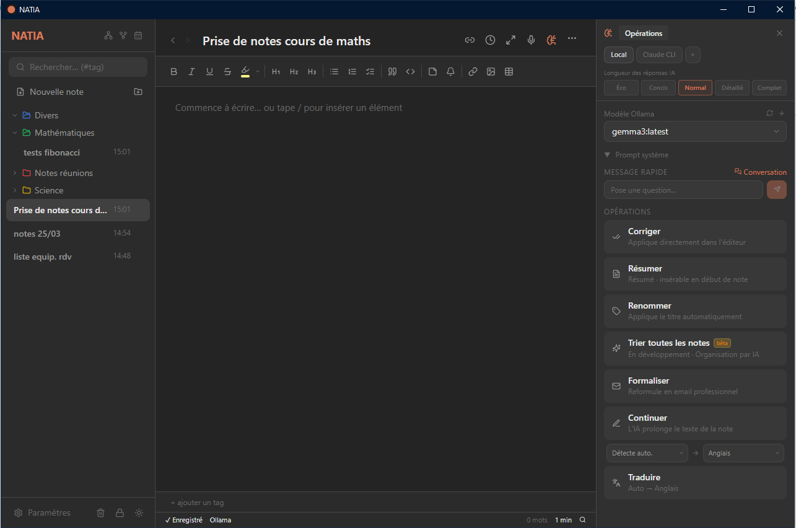
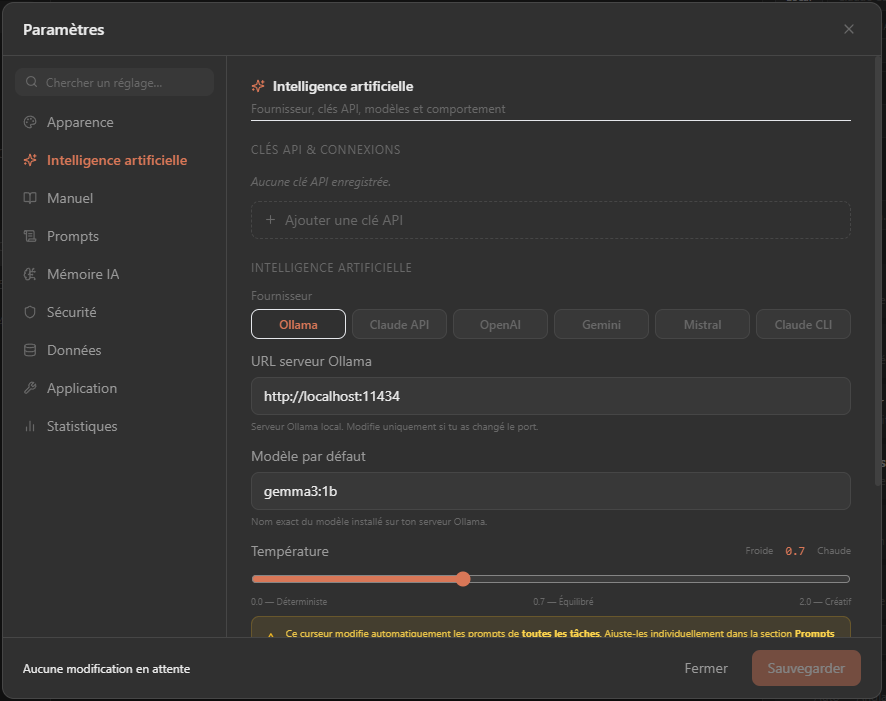
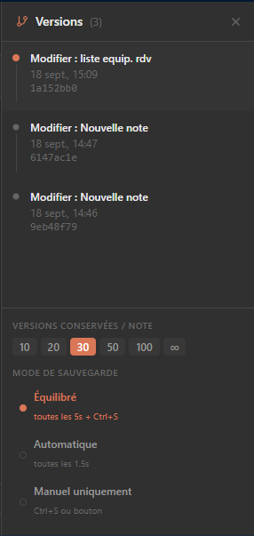
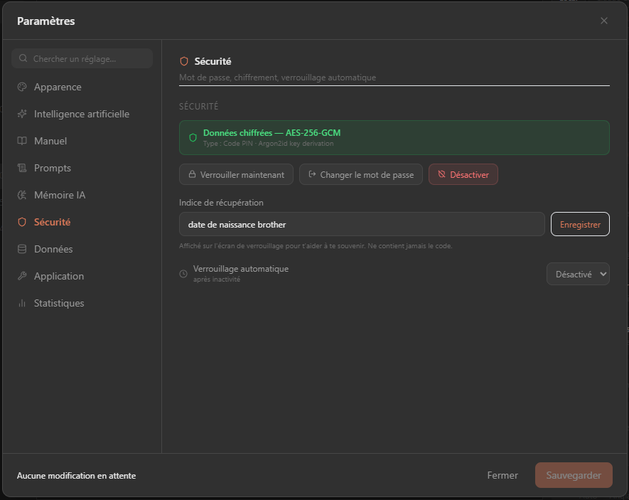
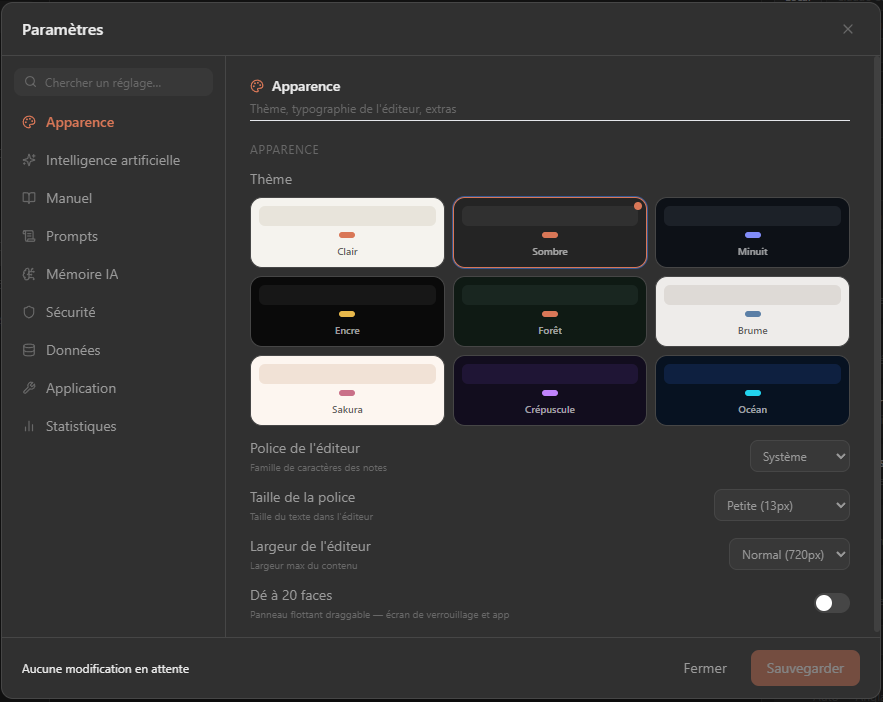

```

                                                     
```
🇫🇷 French developer

**English** · [Français](README.fr.md)

> Local note-taking app with multi-provider AI, Git versioning, AES-256-GCM encryption and dark mode support.

NATIA is a **cross-platform** desktop app (Windows, macOS, Linux) built with **Tauri 2** (Rust backend) and **React 18** (TypeScript frontend). All data is stored locally — no cloud required.



---

## Features

### Editor
- **Rich editor** — TipTap with Markdown support, headings, lists, code blocks, tasks, highlighting, tables, images
- **Sticky notes** — colored, repositionable blocks inside a note
- **Wikilinks** — `[[Note title]]` links with direct navigation
- **Reminders** — reminder blocks with date/time, native Windows notifications when due
- **Focus mode** — full-screen editor without the sidebar (`Esc` to exit)
- **Presentation mode** — slide-by-slide slideshow of the note's content
- **Auto-save** — automatic saving with debounce (1.5 s content / 600 ms title)
- **Close confirmation** — confirmation dialog + save indicator before quitting

### Organization
- **Hierarchical folders** — nested folder tree with drag-and-drop
- **Tree view** — ASCII tree panel (├──/└──) of all folders and notes
- **Graph view** — interactive graph of wikilinks between notes
- **Calendar view** — notes visualized by creation/modification date
- **Backlinks** — panel listing every note that points to the active note
- **Tags** — colored labels on each note
- **Trash** — deletion with restore or permanent removal
- **Templates** — reusable note templates

### Multi-provider AI
- **Ollama** — local AI (Gemma, Phi, Qwen, Llama, Mistral…)
- **Claude API** — Anthropic (claude-haiku, claude-sonnet…)
- **OpenAI** — GPT-4o, GPT-4o-mini…
- **Gemini** — Google Gemini 2.0 Flash…
- **Mistral** — Mistral Small, Medium…
- **Claude CLI** — via the local `claude` CLI (no API key)
- **Custom connections** — API-key manager with name, provider, color and model
- **Operations** — spell-checking, summary, title generation, auto-sorting, translation, email formalization, text continuation
- **Conversation** — chat panel with the active note's context and per-note history
- **AI memory** — persistent context injected into prompts
- **Image generation** — via providers that support it
- **Ollama pull** — download new models directly from the app
- **Streaming** — token-by-token responses for every provider
- **Debug mode** — full trace panel (prompt, response, time, model)



### Search and navigation
- **Full-text search** — real-time search across titles and content
- **Quick open** — `Ctrl+P` to open a note by name (recent notes first)

### Versioning
- **Git versioning** — each save creates a commit; browse history and restore
- **Diff** — comparison between versions



### Security and data
- **AES-256-GCM encryption** — all data encrypted at rest with Argon2id derivation
- **Password protection** — numeric PIN (4-8 digits) or alphanumeric password
- **Auto-lock** — locks after N minutes of inactivity (configurable)
- **ZIP export** — full export or note by note
- **Themes** — 9 themes (Light, Dark, Midnight, Ink, Forest, Mist, Sakura, Dusk, Ocean), persistent and synced with the native title bar
- **Recovery hint** — optional hint shown on the lock screen + reset if you forget your code
- **Offline first** — no cloud dependency, 100% local data (SQLite + HTML files)





### Misc
- **Voice recorder** — audio transcription via AI
- **Statistics** — word, note and activity counts
- **D20 Roller** — built-in 20-sided die
- **Global stats** — overview of the whole note base

---

## Keyboard shortcuts

| Shortcut | Action |
|---|---|
| `Ctrl+N` | New note |
| `Ctrl+F` | Search |
| `Ctrl+,` | Settings |
| `Ctrl+P` | Quick open |
| `Ctrl+G` | Graph view |
| `Ctrl+Shift+A` | AI panel |
| `Ctrl+Shift+H` | Git history |
| `Esc` | Close the active panel / exit focus mode |

---

## Tech stack

| Layer | Technology |
|---|---|
| UI | React 18, TypeScript, Tailwind CSS 3 |
| Editor | TipTap 2 (ProseMirror) |
| State | Zustand |
| Desktop shell | Tauri 2 |
| Backend | Rust (rusqlite, reqwest, chrono, uuid) |
| Encryption | aes-gcm 0.10 (AES-256-GCM), argon2 0.5 (Argon2id), rand 0.8, base64 0.22 |
| Database | SQLite |
| Versioning | Git (via `std::process::Command`) |
| AI | Ollama · Claude API · OpenAI · Gemini · Mistral · Claude CLI |
| Tauri plugins | tauri-plugin-notification, tauri-plugin-dialog |
| Build | Vite 5 |

---

## Prerequisites

- [Node.js](https://nodejs.org/) ≥ 18
- [Rust](https://www.rust-lang.org/tools/install) (stable, via `rustup`)
- [Tauri CLI](https://tauri.app/start/prerequisites/) — installed automatically via npm
- [Git](https://git-scm.com/) — required for note versioning
- [Ollama](https://ollama.com/) *(optional)* — for local AI

---

## Install and develop

```bash
# 1. Clone the repository
git clone https://github.com/Buntasam/NATIA.git
cd NATIA/fablenote

# 2. Install dependencies
npm install

# 3. Run in development mode
npm run tauri dev
```

The frontend starts on `http://localhost:1420`; Tauri opens the native window automatically.

---

## Production build

```bash
cd fablenote
npm run tauri build
```

The installers (`.msi` Windows, `.dmg` macOS, `.AppImage` Linux) are generated in `src-tauri/target/release/bundle/`.

---

## Project structure

```
fablenote/
├── src/                          # React frontend
│   ├── components/
│   │   ├── Layout.tsx            # Main orchestrator + QuickOpen + ConvPanel
│   │   ├── Sidebar.tsx           # Navigation, search, theme toggle, folders, CalendarPanel, GraphPanel
│   │   ├── TreeMapPanel.tsx      # ASCII tree view (├──/└──) of the hierarchy
│   │   ├── CalendarPanel.tsx     # Calendar view of notes
│   │   ├── GraphPanel.tsx        # Interactive wikilink graph
│   │   ├── BacklinksPanel.tsx    # Backlinks panel for the active note
│   │   ├── TemplatesPanel.tsx    # Reusable note templates
│   │   ├── LockScreen.tsx        # Lock screen (PIN / alphanumeric)
│   │   ├── Editor.tsx            # TipTap editor + auto-save + close
│   │   ├── Toolbar.tsx           # Formatting toolbar
│   │   ├── AiPanel.tsx           # AI panel + ConvPanel + debug trace
│   │   ├── ApiKeysPanel.tsx      # Custom AI connection manager
│   │   ├── AiManual.tsx          # In-app AI configuration manual
│   │   ├── ImageGenPanel.tsx     # Image generation
│   │   ├── VoiceRecorder.tsx     # Voice recorder + transcription
│   │   ├── VersionTree.tsx       # Git history + diff + restore
│   │   ├── TrashPanel.tsx        # Trash with restore / permanent delete
│   │   ├── StatsPanel.tsx        # Global statistics
│   │   ├── PresentationMode.tsx  # Slideshow presentation mode
│   │   ├── D20Roller.tsx         # 20-sided die
│   │   ├── ReminderDaemon.tsx    # Reminder check daemon (system notifications)
│   │   ├── CloseOverlay.tsx      # Close confirmation + save overlay
│   │   ├── Disclaimer.tsx        # Beta welcome screen
│   │   └── Settings.tsx          # Settings (model, prompts, security, editor…)
│   ├── extensions/
│   │   ├── PostIt.tsx            # TipTap sticky-note extension
│   │   ├── Wikilink.tsx          # TipTap wikilink [[Note]] extension
│   │   └── Reminder.tsx          # TipTap reminder-with-date extension
│   ├── ai/
│   │   ├── CorrectionModal.tsx   # Accept/reject AI correction modal
│   │   ├── OpButton.tsx          # AI operation button
│   │   └── TraceRow.tsx          # AI debug trace row
│   ├── lib/
│   │   └── aiInvoke.ts           # Multi-provider abstraction (aiChat, aiStream)
│   ├── i18n.ts                   # Interface translations (French/English)
│   ├── store/index.ts            # Global Zustand state
│   ├── hooks/useOllama.ts        # Ollama request hook
│   ├── types/index.ts            # TypeScript types
│   └── index.css                 # CSS variables (light/dark themes)
├── src-tauri/
│   ├── src/
│   │   ├── lib.rs                # Tauri entry point + types + setup
│   │   ├── notes.rs              # Notes/folders/Git/export CRUD commands
│   │   ├── settings.rs           # Settings, API keys, colors, security commands
│   │   ├── ai.rs                 # AI commands (Ollama, Claude, OpenAI, Gemini, Mistral, CLI)
│   │   ├── crypto.rs             # AES-256-GCM + Argon2id
│   │   └── db.rs                 # SQLite initialization + migrations
│   ├── Cargo.toml                # Rust dependencies
│   ├── capabilities/default.json # Tauri permissions (notification, dialog…)
│   └── tauri.conf.json           # Window, bundle and security config
├── index.html                    # HTML entry point
├── tailwind.config.js            # Tailwind config (CSS-variable colors)
└── vite.config.ts                # Vite config
```

---

## Security and encryption

NATIA encrypts all data at rest as soon as a password is enabled. See [docs/ARCHITECTURE.md](docs/ARCHITECTURE.md) for the full details.

**Algorithms**:
- **Key derivation** — Argon2id (19,456 KB RAM, 2 iterations, 1 thread) → 64 bytes
  - Bytes [0..32]: verification hash stored in the DB
  - Bytes [32..64]: AES-256 key kept in RAM only
- **Encryption** — AES-256-GCM, random 12-byte nonce per value
- **Format** — `ENC:v1:{nonce_base64}:{ciphertext_base64}`
- **Scope** — note titles and tags, HTML content, API keys, settings, prompt versions

**Password types**:
- **PIN** — 4 to 8 digits, numeric keypad, ✓ button to confirm
- **Alphanumeric** — free-form password, masked field with eye toggle, Enter or button to confirm

**Management**: Settings → Security — enable / change / disable / lock now. A **recovery hint** and a **reset** option (for a forgotten code) are available too.

---

## AI configuration

### Ollama (local)
1. Install and start [Ollama](https://ollama.com/)
2. Download a model: `ollama pull gemma3:1b` (or any other model)
3. In NATIA → ⚙️ Settings, enter the Ollama URL and select the model

> ⚠️ **Performance note**: local AI can be very slow on long notes. Prefer lightweight models: `gemma3:1b`, `phi4-mini`, `qwen2.5:1.5b`.

### Cloud providers
In Settings → AI, add an API key with the provider you want (Claude, OpenAI, Gemini, Mistral). The connection then becomes available in the AI panel's provider selector. See the built-in **Manual** (Settings → Manual) for a step-by-step guide to every provider.

---

## User data

All data is stored in the OS application-data directory:

| OS | Path |
|---|---|
| Windows | `%APPDATA%\com.natia.app\` |
| macOS | `~/Library/Application Support/com.natia.app/` |
| Linux | `~/.local/share/com.natia.app/` |

- `natia.db` — SQLite database (note metadata, folders, settings, API keys, security config)
- `notes/` — notes' HTML files + internal Git repository (encrypted if a password is enabled)

---

## Contributing

See [docs/CONTRIBUTING.md](docs/CONTRIBUTING.md) for the contribution guide.

---

## License

MIT
